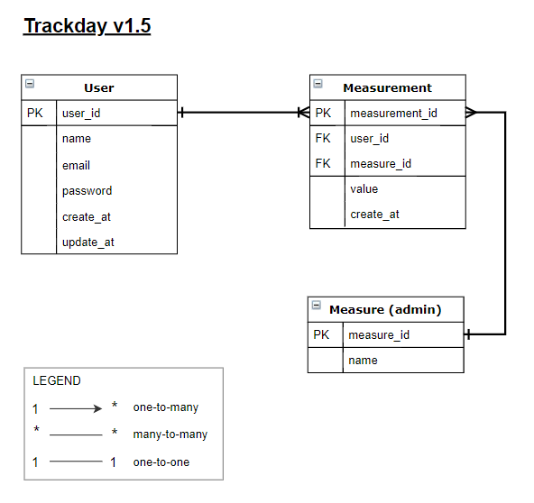

# Track Day API
> This is the backend to track day app.



<br>A full featured API.<br>


## Content
* [Documentation](#documentation)
* [Requirements](#requirements)
* [Requisites](#requisites)
* [Built With](#built-with)
* [Possible Improvements](#possible-improvements)
* [Contributing](#contributing)
* [Author](#author)
* [License](#license)


## Documentation


##### Base URL
https://trackday-api.herokuapp.com/api/v1/


#### End Points
* Create account and receive token<br>
/users<br>
POST, params: username, password

* Login and receive token<br>
/sessions<br>
POST, params: username, password

* Retrieve all measures (Categories like)<br>
/measures<br>
GET, no token required

* Create new measurement<br>
/measurements<br>
POST, params: value, measure_id <br>
Header: Authorization Token <br>


## Requirements
- [x] Draw schema
- [x] Auth with JWT Tokens
- [x] Handle CORs
- [x] Encrypt password
- [x] Deploy


## Requisites

#### Install
You will need install:
* Ruby Language - Version 2.6 - [Install guide](https://www.ruby-lang.org/en/documentation/installation/)

* Ruby on Rails - Version 5.2 - [Install guide](https://guides.rubyonrails.org/v5.0/getting_started.html#installing-rails)


#### Get a local copy
Get a local copy, if you are using Git:
```
git clone git@github.com:SevlaMare/TrackDayAPI.git
```
Otherwise just hit (Download Zip) on green button (Code) at top of this page.


#### Setup

Install all dependencies with:
```
bundle install
```

Setup database with:
```
rake db:schema:load
```

Populate the database with defaults using:
```
rails db:seed
```

#### Run Tests
```
rspec
```

#### Run App
```
rails server
```

Now is available on browser <br>
http://localhost:3000


## Possible improvements
- Middle table for fast queries
- Includes admin


## Built With
- Ruby and Ruby On Rails <br>
- Postgres <br>
- Rspec <br>
- ESlint and Rubocop(Linters) <br>
- GitHub Actions (CI Tool) <br>
- Heroku (Server and CD tool) <br>
- Git, Github and VScode <br>


## Contributing
Contributions, issues and feature requests are welcome!<br>
You can do it on [issues page](issues/).

### Acknowledgments
A special thanks for the code reviewers.

## Author
👤 **Thiago Miranda**
- Github: [@SevlaMare](https://github.com/SevlaMare)
- Twitter: [#SevlaMare](https://twitter.com/SevlaMare)
- Linkedin: [SevlaMare](https://www.linkedin.com/in/sevla-mare)

## License
#### MIT
