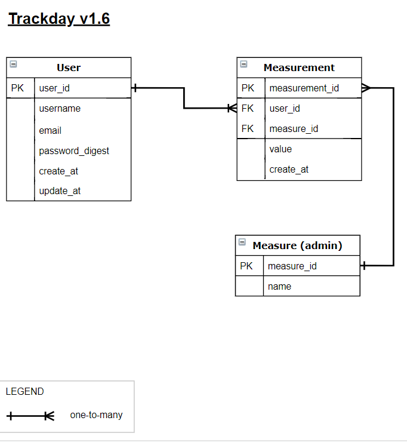

# Track Day API
> This is the backend to track day app.



<br>A full featured API.<br>

## Content
* [Live Demo](#live-demo)
* [Requirements](#requirements)
* [Requisites](#built-with)
* [Built With](#built-with)
* [Future Improvements](#future-improvements)
* [Getting Start](#getting-start)
* [Contributing](#contributing)
* [Author](#author)
* [License](#license)

## Live Demo
You can access a online version at:<br>
https://stock-catalogue.herokuapp.com/

## Requirements
- [x] Implement a catalog with React and Redux
- [x] Setup workflow (Without create-react-app)
- [x] Fetch data from API and store into Redux
- [x] It should have routes and nested routes
- [x] Stateless filter to slice the data
- [x] Make use of Hooks, and only funcitonal components
- [x] Deploy it live

## Requisites
* [A modern web browser](https://www.google.com/chrome/)
* [Node JS](https://nodejs.org/en/download/)

## Possible improvements
- Middle table for fast queries
- Auth with JWT token
- Includes admin

## Built With
- Ruby and Ruby On Rails <br>
- Postgres as database <br>
- Rspec for tests <br>
- ESlint, Rubocop and Stylelint (Linters) <br>
- GitHub Actions (CI Tool) <br>
- Heroku (Server and CD tool) <br>
- Git, Github and VScode <br>

## Getting Start

#### Get a local copy
Now you need a copy of this application, if you are using Git:
```js
git clone git@github.com:SevlaMare/TrackDayAPI.git
```
Otherwise just hit (Download Zip) on green button (Code) at top of this page.

#### Open terminal
Open your terminal inside the game folder, and paste the following commands:

#### Install
To use this program, you will need install:
* Ruby Language - Version 2.6 - [Install guide](https://www.ruby-lang.org/en/documentation/installation/)

* Ruby on Rails - Version 5.2 - [Install guide](https://guides.rubyonrails.org/v5.0/getting_started.html#installing-rails)


#### Get a local copy
Now you need a copy of this application, if you are using Git:
```js
git clone git@github.com:SevlaMare/wallet.git
```
Otherwise just hit (Download Zip) on green button (Clone or Download) at top of this page.


#### Setup
Install all dependencies with:
```bundle install```

Setup database with:
```rake db:schema:load```

and populate the database with defaults using:
```rails db:seed```

#### Go to a web browser (Like Google Chrome) and visit:
```localhost:3000```

#### Run tests
```rspec```

#### Run App
To run, from the application folder, just type on terminal:
```rails server```

Now you can go to your favorite web browser like Google Chrome and access the url
<br> http://localhost:3000


## Contributing

Contributions, issues and feature requests are welcome!

You can do it on [issues page](issues/).

### Acknowledgments

A special thanks for the code reviewers.

## Author

👤 **Thiago Miranda**

- Github: [@SevlaMare](https://github.com/SevlaMare)
- Twitter: [#SevlaMare](https://twitter.com/SevlaMare)
- Linkedin: [SevlaMare](https://www.linkedin.com/in/sevla-mare)

## License
#### MIT
